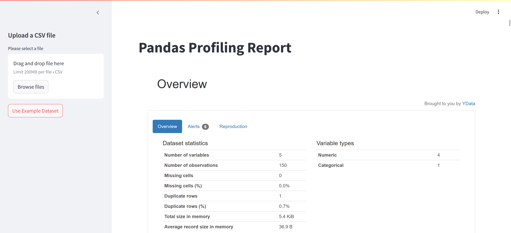

# Pandas-Profiling

This project creates a web application for generating detailed profiling reports of datasets using Streamlit and Pandas Profiling. The application allows users to upload a CSV file or use an example dataset to generate an interactive profiling report.



## Installation
1. Clone this repository:
    ```sh
    git clone https://github.com/sixthnovember/Pandas-Profiling.git
    cd Pandas-Profiling
    ```
2. Install the required packages:
    ```sh
    pip install -r requirements.txt
    ```
3. Run the Streamlit application:
    ```sh
    streamlit run app.py
    ```

## Usage
1. Open your web browser and navigate to the local address where Streamlit is running, typically `http://localhost:8501`.
2. Upload your CSV file or click the 'Use Example Dataset' button.
3. A profiling report for the dataset will be generated and displayed.